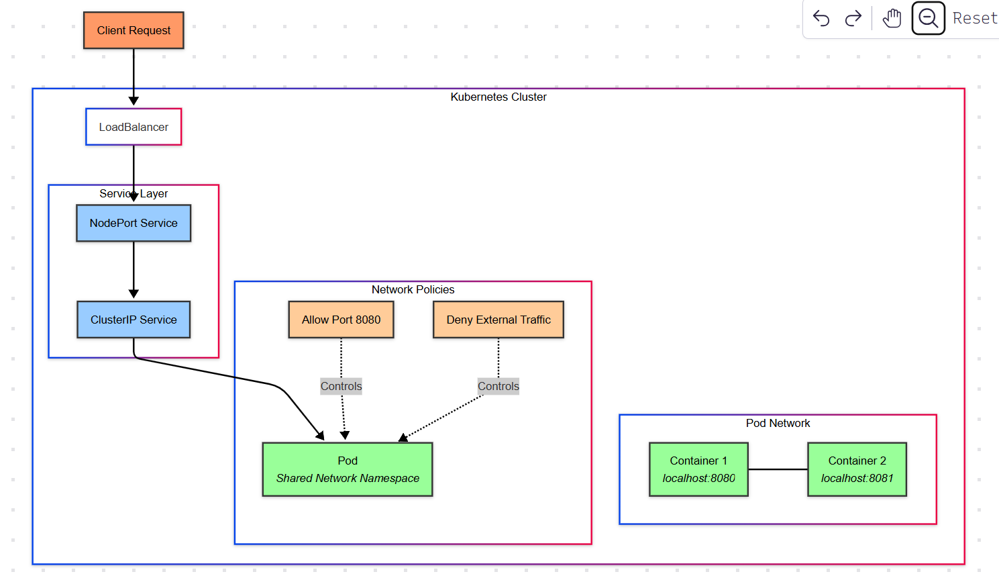

# Docker Fundamentals & Container Networking Study Notes 🐳

## I. Docker Fundamentals 📦

### A. What is Docker? 🤔

* Docker is a platform for developing, shipping, and running applications in isolated environments called **containers**.
* Think of containers as lightweight, portable, and executable packages of software that include everything needed to run an application: code, runtime, system tools, libraries, and settings.
* Docker simplifies the deployment process and ensures consistency across different environments (development, testing, production).

### B. Key Docker Concepts 🔑

* **Docker Image:** 🖼️
    * A read-only template that contains instructions for creating a Docker container.
    * Built from a **Dockerfile**.
    * Stored in a **Docker Registry** (e.g., Docker Hub).
    * Think of it like a blueprint for a container.
* **Docker Container:** 🏃‍♀️
    * A runnable instance of a Docker image.
    * Isolated from the host system and other containers.
    * Can be started, stopped, moved, and deleted.
    * Think of it like a running application based on the blueprint.
* **Dockerfile:** 📝
    * A text file that contains all the commands a user could call on the command line to assemble an image.
    * Specifies the base image, software to install, environment variables, commands to run, etc.
    * Build process creates Docker images layer by layer.
* **Docker Registry:** 🏢
    * A centralized repository for storing and sharing Docker images.
    * **Docker Hub** is the default public registry.
    * Private registries can also be set up.
    * `docker pull` command retrieves images from a registry.
    * `docker push` command uploads images to a registry.
* **Docker Engine:** ⚙️
    * The core service that builds and runs Docker containers.
    * Consists of:
        * **Docker Daemon (`dockerd`):** A persistent background process that manages Docker images, containers, networks, and volumes.
        * **Docker Client (`docker`):** A command-line interface (CLI) that allows users to interact with the Docker Daemon.
        * **REST API:** Used by the Docker Client to communicate with the Docker Daemon.

### C. Basic Docker Commands ⌨️

* `docker run <image_name>`: Creates and starts a container from an image.
* `docker ps`: Lists running containers.
* `docker ps -a`: Lists all containers (running and stopped).
* `docker stop <container_id>`: Stops a running container.
* `docker start <container_id>`: Starts a stopped container.
* `docker restart <container_id>`: Restarts a container.
* `docker rm <container_id>`: Removes one or more containers.
* `docker rmi <image_id>`: Removes one or more images.
* `docker build -t <image_name> .`: Builds a Docker image from a Dockerfile in the current directory.
* `docker pull <image_name>`: Pulls an image from a Docker registry.
* `docker push <image_name>`: Pushes an image to a Docker registry (requires login).
* `docker images`: Lists locally available Docker images.
* `docker logs <container_id>`: Shows the logs of a container.
* `docker exec -it <container_id> <command>`: Executes a command inside a running container (interactive terminal).

### D. Dockerfile Instructions 🛠️

* `FROM <base_image>`: Specifies the base image to start from.
* `RUN <command>`: Executes commands in a new layer on top of the current image.
* `COPY <src> <dest>`: Copies files or directories from the host to the container's filesystem.
* `ADD <src> <dest>`: Similar to `COPY`, but can also extract archives and fetch remote URLs.
* `WORKDIR <path>`: Sets the working directory for subsequent `RUN`, `CMD`, `ENTRYPOINT`, `COPY`, and `ADD` instructions.
* `ENV <key>=<value>`: Sets environment variables.
* `EXPOSE <port>`: Informs Docker that the container listens on the specified network ports at runtime.
* `CMD ["executable", "param1", "param2"]`: Provides the default command to execute when the container starts. Can be overridden.
* `ENTRYPOINT ["executable", "param1", "param2"]`: Configures the container to run as an executable. Arguments passed to `docker run` are appended.
* `USER <user>`: Sets the user to run subsequent commands as.
* `VOLUME ["/data"]`: Creates a mount point for a named or anonymous volume.

### E. Docker Images and Layers 🧅

* Docker images are built in layers, where each instruction in the Dockerfile creates a new layer.
* Layers are cached, which speeds up subsequent builds.
* Changes to an image only require rebuilding the layers that have changed and the layers that depend on them.
* This layered architecture contributes to Docker's efficiency and smaller image sizes.

## II. Docker Container Networking 🌐

### A. Docker Network Drivers 🚦

* Docker provides different network drivers to manage how containers communicate with each other and the outside world.
* Common drivers include:
    * **Bridge (default):** Creates a private internal network for containers on the same host. Containers can communicate with each other via IP addresses. The host acts as a router and firewall.
    * **Host:** Bypasses Docker's network isolation. Containers directly use the host's network interfaces and ports. Useful for performance-sensitive applications but reduces isolation. ⚠️
    * **None:** Disables all networking for a container. Useful for isolated tasks. 🚫
    * **Overlay:** Enables communication between containers running on different Docker hosts (used with Docker Swarm or other multi-host setups). 🌉
    * **Macvlan:** Assigns a MAC address to a container's virtual network interface, making it appear as a physical device on the network. 💻
    * **Custom Network Drivers:** Allow for more advanced or specialized networking configurations.

### B. Container Communication within a Bridge Network 🗣️

* Containers on the same bridge network can communicate with each other using their IP addresses.
* Docker also provides **DNS-based service discovery** within a user-defined bridge network. Containers can refer to each other by their container names (or service names in Docker Compose).
* **Port Mapping (Port Publishing):** To allow external access to a container's services, you need to map ports from the host to the container using the `-p` flag with `docker run`.
    * `-p host_port:container_port`: Maps a specific host port to a container port.
    * `-p container_port`: Docker will automatically assign a random high port on the host.

### C. User-Defined Bridge Networks 🌉

* It's generally recommended to create **user-defined bridge networks** instead of relying on the default bridge network.
* Benefits of user-defined networks:
    * **Better Isolation:** Provides better isolation between sets of containers.
    * **DNS Resolution:** Automatic DNS resolution by container name.
    * **Link Containers:** Allows linking containers (though user-defined networks are the preferred approach now).
    * **Configuration:** Easier to manage and configure.
* Commands for managing user-defined networks:
    * `docker network create <network_name>`: Creates a new network.
    * `docker network ls`: Lists Docker networks.
    * `docker network inspect <network_name>`: Displays detailed information about a network.
    * `docker network connect <network_name> <container_id>`: Connects a running container to a network.
    * `docker network disconnect <network_name> <container_id>`: Disconnects a container from a network.
    * `docker network rm <network_name>`: Removes a network.

### D. Container Communication with the Host 🏠

* Containers on a bridge network can communicate with the host's IP address.
* Port mapping (`-p`) is the primary way for external clients to access services running inside containers.
* When using the `host` network driver, containers directly share the host's network stack, so no explicit port mapping is needed.

### E. Multi-Host Networking with Overlay Networks 🔗

* Overlay networks enable containers running on different Docker hosts to communicate as if they were on the same local network.
* Typically used with orchestration tools like Docker Swarm or Kubernetes.
* Requires a key-value store (e.g., Consul, etcd, ZooKeeper) for managing the network state.

### F. Use Cases for Container Networking 💡

* **Web Applications:** Exposing web servers (HTTP/HTTPS) to the host using port mapping. 🌐
* **Microservices Communication:** Allowing different microservices running in separate containers to communicate with each other within a private network (user-defined bridge). ⚙️🔗⚙️
* **Database Access:** Connecting application containers to database containers on the same network, restricting external access to the database. 🔒<0xF0><0x9F><0x97><0x84>
* **Load Balancing:** Integrating Docker networking with load balancers to distribute traffic across multiple container instances. ⚖️
* **Service Discovery:** Enabling containers to automatically discover and communicate with other services on the network (using DNS within user-defined networks or dedicated service discovery tools). 🧭

------------------------------------------------------------------------------------------------------------------------------------------

# Docker Fundamentals & Container Networking Study Notes 🐳

## I. Docker Fundamentals 📦

**(Previous content remains the same)**

## II. Docker Container Networking 🌐

**(Previous content remains the same)**

### F. Use Cases for Container Networking 💡

* **Web Applications with Load Balancing:** 🌐⚖️
    * **Scenario:** You have multiple instances of a web application running in separate Docker containers to handle increased traffic and ensure high availability.
    * **Networking:**
        * Create a user-defined bridge network for the web application containers.
        * Deploy a load balancer (e.g., Nginx, HAProxy, Traefik as a container or externally) that is also connected to this network.
        * Map the load balancer's HTTP/HTTPS ports (80/443) to the host using `-p`.
        * The load balancer distributes incoming traffic across the web application containers within the internal network.
        * **Benefits:** Improved performance, scalability, and resilience.

* **Microservices Communications:** ⚙️🔗⚙️
    * **Scenario:** Your application is broken down into multiple independent microservices running in separate Docker containers. These services need to communicate with each other.
    * **Networking:**
        * Create a dedicated user-defined bridge network for the microservices.
        * Connect all the microservice containers to this network.
        * **Communication:**
            * **Direct IP Address (Less Ideal):** Services can communicate using each other's container IP addresses on the network. However, IP addresses can change upon container restart.
            * **Docker DNS (Preferred):** Docker provides automatic DNS resolution within the user-defined network. Containers can communicate using their container names (or service names in Docker Compose). For example, a `web-service` container can resolve the address of an `api-service` container simply by using `api-service` as the hostname.
        * **Benefits:** Isolated communication, simplified service discovery within the network.

* **Service Discovery for Microservices:** 🧭⚙️
    * **Scenario:** In a dynamic microservices environment, the number and location of service instances can change frequently. Service discovery mechanisms allow services to automatically find and communicate with each other without hardcoding IP addresses or hostnames.
    * **Networking (with a Service Discovery Tool):**
        * Deploy a service discovery tool (e.g., Consul, etcd, ZooKeeper) as a Docker container on a shared network.
        * Microservice containers register themselves with the service discovery tool upon startup, providing their name, IP address, and port.
        * Other microservices query the service discovery tool to find the network location of the services they need to communicate with.
        * **Integration:** Applications use client libraries provided by the service discovery tool to interact with it.
        * **Benefits:** Dynamic and resilient communication, automatic adaptation to changes in the service landscape.

* **Database Access from Application Containers:** 🔒
    * **Scenario:** Your application running in a Docker container needs to connect to a database running in another container or on the host.
    * **Networking (Containers on the same network):**
        * Create a user-defined bridge network and connect both the application and database containers to it.
        * The application container can typically connect to the database using the database container's name (via Docker DNS) and the database's standard port (e.g., 5432 for PostgreSQL, 3306 for MySQL).
        * Avoid mapping the database port directly to the host unless absolutely necessary for external administration, and if so, secure it properly.
    * **Networking (Application container accessing host database):**
        * If the database is running directly on the host, the application container can often connect using the host's IP address (or `host.docker.internal` on newer Docker versions) and the database port. However, this bypasses network isolation.
        * A more controlled approach might involve creating a specific network and carefully managing access.
    * **Benefits:** Secure and isolated communication between application and database, easier management of database access.

------------------------------------------------------------------------------------------------------------------------------------------
# Advanced Docker Concepts Study Notes 🐳

## I. Docker Volumes 💾

### A. Understanding Data Persistence in Containers

* Containers are ephemeral by nature. When a container is stopped and removed, any data written to its filesystem is lost.
* **Docker Volumes** provide a way to persist and share data between containers and the host machine.

### B. Types of Volumes

* **Named Volumes:** 🏷️
    * Managed by Docker.
    * Have a specific name.
    * Easier to back up, restore, and share between containers.
    * Stored in a directory managed by Docker on the host (`/var/lib/docker/volumes/` on Linux).
    * Created using `docker volume create <volume_name>`.
    * Mounted to containers using the `-v <volume_name>:<container_path>` flag in `docker run` or in Docker Compose.
* **Bind Mounts:** 🔗
    * Mount a file or directory from the host machine directly into a container.
    * Data is stored on the host filesystem at the specified path.
    * Less isolated than named volumes as the container has direct access to the host filesystem.
    * Useful for development when you need to quickly reflect code changes inside the container.
    * Mounted using the `-v <host_path>:<container_path>` flag in `docker run` or in Docker Compose.
* **tmpfs Mounts:** 💨
    * Store data in the host's system memory.
    * Not persisted on the host filesystem.
    * Faster than named volumes or bind mounts.
    * Useful for storing temporary, non-sensitive data.
    * Mounted using the `--mount type=tmpfs,destination=<container_path>` flag in `docker run` or in Docker Compose.

### C. Managing Volumes

* `docker volume ls`: Lists existing Docker volumes.
* `docker volume inspect <volume_name>`: Displays detailed information about a volume.
* `docker volume rm <volume_name>`: Removes one or more volumes (must not be in use by any container).
* `docker volume prune`: Removes all unused local volumes.

### D. Use Cases for Volumes

* **Databases:** Persisting database files so data is not lost when the container restarts. 💾
* **Application Data:** Storing user uploads, logs, or configuration files. 📁
* **Sharing Code (Development):** Using bind mounts to share source code between the host and development containers. 💻
* **Configuration:** Mounting configuration files into containers. ⚙️

## II. Docker Compose 🚢

### A. Defining Multi-Container Applications

* **Docker Compose** is a tool for defining and running multi-container Docker applications.
* Uses a YAML file (`docker-compose.yml`) to configure the application's services, networks, and volumes.
* Allows you to manage the entire application stack with a single command.

### B. `docker-compose.yml` Structure

* **`version`:** Specifies the Docker Compose file format version.
* **`services`:** Defines the individual containers (services) that make up the application. Each service definition includes:
    * `image`: The Docker image to use.
    * `ports`: Port mappings between the host and the container.
    * `volumes`: Volume mounts (named volumes, bind mounts).
    * `environment`: Environment variables.
    * `depends_on`: Specifies dependencies between services.
    * `networks`: The networks the service should be connected to.
    * `build`: Specifies the Dockerfile to build the image from (instead of pulling).
    * `command`: Overrides the default command of the image.
* **`networks`:** Defines custom networks for the application.
* **`volumes`:** Defines named volumes.

### C. Common Docker Compose Commands

* `docker-compose up`: Creates and starts all services defined in the `docker-compose.yml` file. Use `-d` for detached mode (running in the background).
* `docker-compose down`: Stops and removes containers, networks, volumes, and images created by `up`.
* `docker-compose ps`: Lists the status of the services.
* `docker-compose logs <service_name>`: Shows the logs of a specific service.
* `docker-compose exec <service_name> <command>`: Executes a command in a running service container.
* `docker-compose build`: Builds the images for the services defined in the `docker-compose.yml` file.
* `docker-compose scale <service_name>=<num>`: Scales the number of instances for a specific service.

### D. Benefits of Docker Compose

* Simplifies the management of multi-container applications.
* Makes it easy to define and reproduce application environments.
* Improves collaboration by providing a consistent way to run the application.

## III. Docker Networking (Advanced) 🔗

### A. Container Linking (Legacy)

* **Container Linking** was an older way to allow containers to discover and communicate with each other.
* Provided environment variables containing connection information (e.g., IP address, ports) of the linked container.
* **User-defined networks are now the preferred and recommended way** to handle inter-container communication.

### B. Inter-Host Communication

* **Overlay Networks (Recap):** Enable seamless communication between containers running on different Docker hosts. Often used with Docker Swarm.
* **Exposed Ports and Host Networking:** Containers can expose ports on the host's network interfaces, allowing communication from other hosts. However, this requires managing port conflicts and reduces isolation.
* **Service Mesh (Beyond Basic Docker):** Technologies like Istio and Linkerd provide advanced networking features (traffic management, security, observability) for microservices deployed across multiple hosts (often in Kubernetes). While not strictly Docker features, they build upon container networking.

### C. DNS and Service Discovery (Advanced)

* **External DNS:** Integrating Docker with external DNS providers to automatically register container IP addresses with DNS records.
* **Dedicated Service Discovery Tools (Recap):** Consul, etcd, ZooKeeper provide more sophisticated service registration and discovery mechanisms.

## IV. Docker Security Hardening 🛡️

### A. Image Security

* **Use Minimal Base Images:** Start with small and secure base images (e.g., `alpine`).
* **Scan Images for Vulnerabilities:** Use tools like `docker scan`, Trivy, or Clair to identify security vulnerabilities in your images.
* **Keep Images Updated:** Regularly rebuild images to include the latest security patches.
* **Avoid Installing Unnecessary Software:** Reduce the attack surface by only including essential packages.
* **Use Non-Root Users:** Run processes inside containers as non-root users using the `USER` instruction in the Dockerfile.

### B. Container Security

* **Resource Limits:** Use `docker run` flags (`--memory`, `--cpus`) or Docker Compose to limit the resources a container can consume, preventing denial-of-service attacks.
* **Read-Only Filesystems:** Mount the container's root filesystem as read-only using `--read-only` to prevent unauthorized modifications.
* **Capabilities:** Drop unnecessary Linux kernel capabilities using `--cap-drop all` and selectively add required capabilities using `--cap-add`.
* **Seccomp Profiles:** Use Seccomp (Secure Computing Mode) profiles to restrict the system calls a container can make. Docker has default profiles, and you can define custom ones.
* **Network Policies (with Orchestration):** In orchestration platforms like Kubernetes, network policies can control network traffic between pods (containers).

### C. Docker Daemon Security

* **Control Access to the Docker Daemon:** Restrict who can interact with the Docker Daemon (e.g., using Unix group permissions or TLS authentication).
* **Enable Content Trust:** Use Docker Content Trust to verify the integrity and publisher of Docker images.

## V. Docker Orchestration (Introduction)  оркестр 🎶

* While Docker Compose is useful for local development and small-scale deployments, **Docker Orchestration** tools are essential for managing Dockerized applications at scale across multiple hosts.
* **Docker Swarm:** Docker's native orchestration solution. Provides features like clustering, service discovery, load balancing, and scaling.
* **Kubernetes (K8s):** A more powerful and widely adopted container orchestration platform. Offers advanced features for deployment, scaling, management, and self-healing of containerized applications.
* **Key Orchestration Concepts:** Nodes, Clusters, Services, Tasks/Pods, Replication, Scaling, Load Balancing, Service Discovery.
------------------------------------------------------------------------------------------------------------------------------------------

# Kubernetes Core Concepts ☸️

## I. Introduction to Kubernetes (K8s) 🤔

* Kubernetes (also known as K8s or kube) is an open-source **container orchestration platform** that automates the deployment, scaling, and management of containerized applications.
* It provides a framework for running distributed systems resiliently, with built-in features for service discovery, load balancing, storage orchestration, and automated rollouts and rollbacks.
* Kubernetes aims to make deploying and managing containerized applications easier and more scalable.

## II. Core Kubernetes Objects 🧱

These are the fundamental building blocks of a Kubernetes cluster.

### A. Pods 🏃‍♀️

* The smallest and most basic deployable unit in Kubernetes.
* Represents a single instance of a running process in a cluster.
* Can contain one or more **containers** (e.g., Docker containers) that are tightly coupled and share resources like:
    * **Shared Storage (Volumes):** Allows containers within a pod to share data.
    * **Networking:** A single IP address and port space for all containers in the pod.
    * **Container Lifecycle Management:** Containers in a pod are managed as a single unit.
* Pods are generally **ephemeral** and can be restarted or rescheduled. Higher-level controllers manage pods.

### B. Nodes 🖥️

* A worker machine in Kubernetes (could be a physical or virtual machine).
* Managed by the **Control Plane**.
* Runs the **kubelet** agent, which is responsible for managing the Pods running on the Node.
* Also runs the **kube-proxy**, which handles network routing and load balancing for Services.
* The Control Plane schedules Pods to run on Nodes based on resource availability and other constraints.

### C. Control Plane 🧠

The brain of the Kubernetes cluster, responsible for making global decisions about the cluster and detecting and responding to cluster events. Key components include:

* **kube-apiserver:** The front-end for the Kubernetes control plane. Exposes the Kubernetes API, allowing users, other control plane components, and nodes to communicate with the cluster.
* **etcd:** A highly available key-value store used as Kubernetes' backing store for all cluster data. Critical for cluster consistency.
* **kube-scheduler:** Watches for newly created Pods that have no Node assigned and selects a Node for them to run on based on resource requirements, constraints, and policies.
* **kube-controller-manager:** Runs controller processes, which are responsible for regulating the state of the cluster. Examples include:
    * **Node Controller:** Manages Nodes (e.g., handling Node failures).
    * **Replication Controller/ReplicaSet Controller/Deployment Controller:** Manages the desired number of Pod replicas.
    * **Endpoints Controller:** Populates the Endpoints object (IP addresses and ports of Pods backing a Service).
    * **Service Controller:** Manages LoadBalancers and other external interfaces for Services.
* **cloud-controller-manager (Optional):** An optional component that interacts with the underlying cloud provider's APIs to manage cloud-specific resources (e.g., load balancers, storage).

### D. Namespaces 🏢

* Virtual clusters within a single physical Kubernetes cluster.
* Provide a way to partition resources and isolate groups of users or projects.
* Resource names need to be unique within a namespace but can be the same across different namespaces.
* Default namespaces include `default`, `kube-system`, `kube-public`, and `kube-node-lease`.

## III. Workload Controllers ⚙️

These controllers manage Pods and ensure the desired state of your applications.

### A. ReplicaSet

* Ensures a specified number of Pod replicas are running at any given time.
* If a Pod dies, the ReplicaSet creates a new one to maintain the desired count.
* Uses a **selector** to identify the Pods it manages.

### B. Deployment

* Provides declarative updates for Pods and ReplicaSets.
* Enables rolling updates and rollbacks of application versions without downtime.
* Manages the lifecycle of ReplicaSets.
* Recommended way to manage stateless applications.

### C. StatefulSet

* Manages the deployment and scaling of **stateful** applications (e.g., databases).
* Provides stable, unique network identifiers, persistent storage per Pod, and ordered, graceful deployment and scaling.
* Useful for applications that require stable identities and persistent data.

### D. DaemonSet

* Ensures that a copy of a Pod runs on **all (or a specified subset of) Nodes** in the cluster.
* Useful for cluster-level agents like log collectors, monitoring agents, and network plugins.

### E. Job

* Creates one or more Pods and ensures that a specified number of them successfully terminate.
* Useful for batch processing tasks.

### F. CronJob

* Creates Jobs on a repeating schedule, similar to the `cron` utility in Linux.
* Useful for scheduled tasks like backups and report generation.

## IV. Services 🔗

An abstraction layer that defines a logical set of Pods and a policy by which to access them. Services provide a stable IP address and DNS name for accessing Pods, even if the underlying Pods are ephemeral.

### A. Service Types

* **ClusterIP (Default):** Exposes the Service on a cluster-internal IP, accessible only from within the cluster.
* **NodePort:** Exposes the Service on each Node's IP at a static port (chosen from a range). Accessible from outside the cluster using `NodeIP:NodePort`. Automatically creates a ClusterIP Service.
* **LoadBalancer:** Provisions an external load balancer (provided by the cloud provider) that exposes the Service externally. Traffic to the load balancer is forwarded to the Service's NodePort and ClusterIP. Automatically creates a NodePort and ClusterIP Service.
* **ExternalName:** Maps the Service to the DNS name of an external service. No proxying is done.

### B. Selectors

* Services use **selectors** to determine which Pods they target.
* A selector is a set of labels that are matched against the labels of Pods.

### C. Endpoints

* An Endpoints object is automatically created when a Service has a selector.
* It lists the IP addresses and ports of the Pods that match the Service's selector.

## V. Storage 💾

Kubernetes provides abstractions for managing storage for containers.

### A. Volumes (Kubernetes Volumes)

* Represent a directory accessible to the containers in a Pod.
* Have a lifecycle that is tied to the Pod.
* Several types of volumes are supported (e.g., `emptyDir`, `hostPath`, `nfs`, `configMap`, `secret`, `persistentVolumeClaim`).

### B. Persistent Volumes (PV)

* A piece of storage in the cluster that has been provisioned by an administrator or dynamically provisioned using Storage Classes.
* Has a lifecycle independent of any individual Pod.
* Represents durable storage in the cluster.

### C. Persistent Volume Claims (PVC)

* A request for storage by a user.
* Pods use PVCs to request access to PVs.
* Kubernetes matches PVCs to available PVs based on size, access modes, and Storage Class.

### D. Storage Classes

* Provide a way for administrators to describe the "classes" of storage they offer.
* Enable dynamic provisioning of PVs when a PVC is created.

## VI. Configuration ⚙️

### A. ConfigMaps

* API objects used to store non-confidential configuration data as key-value pairs.
* Can be consumed by Pods as environment variables, command-line arguments, or as configuration files in a volume.

### B. Secrets

* API objects used to store sensitive information, such as passwords, API tokens, and SSH keys.
* Data stored in Secrets is base64 encoded.
* Can be consumed by Pods as environment variables or as files in a volume.

This covers the core concepts of Kubernetes. Next, we'll delve into more advanced topics.

------------------------------------------------------------------------------------------------------------------------------------------

# Kubernetes Advanced Concepts ☸️ (Part 2)

## I. Advanced Scheduling 🗓️

### A. Node Selectors

* Allow you to constrain Pods to run on Nodes that have specific labels.
* Defined in the Pod specification under `spec.nodeSelector`.

### B. Node Affinity and Anti-Affinity

* Provide more flexible ways to constrain Pods to Nodes based on labels.
* **Node Affinity:** Attracts Pods to Nodes with matching labels (`requiredDuringSchedulingIgnoredDuringExecution`, `preferredDuringSchedulingIgnoredDuringExecution`).
* **Node Anti-Affinity:** Prevents Pods from being scheduled on Nodes with matching labels.

### C. Taints and Tolerations

* **Taints** are applied to Nodes to repel certain Pods.
* **Tolerations** are applied to Pods to allow them to be scheduled on Nodes with matching Taints.
* Useful for dedicating Nodes to specific workloads (e.g., GPU nodes).

### D. Pod Affinity and Anti-Affinity

* Control how Pods are placed relative to other Pods based on their labels and the Nodes they are running on.
* **Pod Affinity:** Attracts Pods to Nodes where other Pods with matching labels are running.
* **Pod Anti-Affinity:** Prevents Pods from being scheduled on Nodes where other Pods with matching labels are running (e.g., for high availability).

### E. Resource Requests and Limits

* **Requests:** The amount of resources (CPU, memory) that a Pod is guaranteed to get. The scheduler uses requests to decide which Node a Pod can run on.
* **Limits:** The maximum amount of resources that a Pod is allowed to consume. Kubernetes can throttle or evict Pods that exceed their limits.
* Important for resource management and preventing noisy neighbors.

### F. Quality of Service (QoS) Classes

* Kubernetes assigns QoS classes to Pods based on their resource requests and limits:
    * **Guaranteed:** Pods have both CPU and memory requests equal to their limits. Highest priority, least likely to be evicted.
    * **Burstable:** Pods have either CPU or memory requests (or both) less than their limits. Medium priority, more likely to be evicted than Guaranteed.
    * **BestEffort:** Pods have no resource requests or limits. Lowest priority, most likely to be evicted when resources are scarce.

## II. Security in Kubernetes 🔒

### A. Role-Based Access Control (RBAC)

* Controls who can perform what actions on which resources in the Kubernetes API.
* Involves:
    * **Roles/ClusterRoles:** Define sets of permissions (verbs like `get`, `list`, `create`, `delete` on resources like `pods`, `deployments`). ClusterRoles are cluster-wide.
    * **Subjects:** Users, Groups, and Service Accounts that are granted permissions.
    * **RoleBindings/ClusterRoleBindings:** Grant Roles or ClusterRoles to Subjects within a specific namespace (RoleBinding) or cluster-wide (ClusterRoleBinding).

### B. Network Policies

* Control network traffic between Pods.
* By default, all Pods in a cluster can communicate freely. Network Policies allow you to define rules to restrict ingress and egress traffic based on labels.
* Implemented by network plugins (e.g., Calico, Cilium).



```
Pod: A pod is a group of one or more containers that share the same network namespace and IP address. Containers within a pod can communicate with each other using localhost. Pods are the smallest unit of deployment in Kubernetes.

Service: A service is an abstraction that defines a logical set of pods and a policy to access them. A service provides a stable and consistent IP address and DNS name for the pods, regardless of where they are scheduled or how they are scaled. Services can be of different types, such as ClusterIP, NodePort, LoadBalancer, or ExternalName. Services allow pods to communicate with each other across nodes or clusters.

Ingress: An ingress is an API object that defines rules to expose services to external traffic. An ingress controller is responsible for fulfilling the ingress rules by routing the traffic to the appropriate services. An ingress can provide features such as load balancing, SSL termination, name-based virtual hosting, etc. Ingress allows pods to communicate with external clients or services.
```


<!-- add image for k8 networking-->
![[imge]](svgs/k8networking.svg)

### C. Secrets Management (Advanced)

* Using external secret management solutions (e.g., HashiCorp Vault, AWS Secrets Manager, Azure Key Vault) and integrating them with Kubernetes.
* Techniques like Secret rotation and encryption at rest.

### D. Security Contexts

* Define the security parameters for Pods and containers, such as:
    * Running as a non-root user (`runAsUser`, `runAsGroup`).
    * Linux capabilities (`add`, `drop`).
    * SELinux labels.
    * Read-only root filesystem.

### E. Admission Controllers

* Gatekeepers that intercept requests to the Kubernetes API server prior to persistence of the object, but after the request is authenticated and authorized.
* Can validate or mutate requests based on custom policies (e.g., preventing privileged containers).

## III. Advanced Networking 🌐

### A. Ingress

* An API object that manages external access to the Services in a cluster, typically via HTTP and HTTPS.
* Acts as a reverse proxy and load balancer.
* Requires an **Ingress Controller** (e.g., Nginx Ingress Controller, Traefik) to be deployed in the cluster to implement the Ingress rules.

### B. Service Mesh (Recap & Deep Dive)

* Provides a dedicated infrastructure layer for handling service-to-service communication.
* Offers features like:
    * **Traffic Management:** Load balancing, routing, traffic splitting (canary deployments).
    * **Security:** Mutual TLS (mTLS), authentication, authorization.
    * **Observability:** Metrics, tracing, logging.
* Popular Service Mesh implementations: Istio, Linkerd, Consul Connect.

### C. Container Network Interface (CNI)

* A specification that defines an interface between the container runtime (e.g., Docker, containerd) and network plugins.
* Allows Kubernetes to be flexible and support various networking solutions.
* Common CNI plugins: Calico, Cilium, Flannel, Weave Net.

## IV. Custom Resource Definitions (CRDs) and Operators ⚙️➕

### A. Custom Resource Definitions (CRDs)

* Allow you to extend the Kubernetes API by defining your own custom resources.
* Enable you to manage application-specific configurations and behaviors using Kubernetes-style APIs.

### B. Operators

* Extend Kubernetes functionality to automate the management of stateful applications and complex workloads.
* Combine CRDs with custom controllers that implement the operational knowledge for a specific application (e.g., managing a database cluster, a message queue).
* Automate tasks like provisioning, scaling, backups, and upgrades.
* Examples of Operators: etcd Operator, Prometheus Operator, Kafka Operator.

## V. Monitoring and Logging 📊

### A. Metrics Collection

* Using tools like Prometheus to scrape metrics from Kubernetes components and application Pods.
* Kubernetes provides built-in metrics through the Metrics API (kubelet, cAdvisor).

### B. Log Aggregation

* Centralizing logs from all Pods and Nodes using tools like Elasticsearch, Fluentd, and Kibana (EFK stack) or Loki and Promtail.

### C. Tracing

* Implementing distributed tracing to understand the flow of requests across microservices (e.g., using Jaeger or Zipkin).

### D. Alerting

* Configuring alerts based on metrics and logs using tools like Alertmanager (with Prometheus).

## VI. Autoscaling 🚀

### A. Horizontal Pod Autoscaler (HPA)

* Automatically scales the number of Pod replicas in a Deployment, ReplicaSet, or StatefulSet based on observed CPU utilization, memory utilization, or custom metrics.

### B. Vertical Pod Autoscaler (VPA)

* Automatically adjusts the CPU and memory requests and limits of Pods based on their resource usage over time. Can also recommend initial resource settings.

### C. Cluster Autoscaler

* Automatically adjusts the size of the Kubernetes cluster (the number of Nodes) based on the resource needs of the scheduled Pods. Integrates with cloud provider auto-scaling groups.

## VII. Multi-Cluster Management 🏢🏢

* Managing multiple Kubernetes clusters, which can be necessary for various reasons (e.g., high availability, disaster recovery, regional deployments).
* Tools and approaches:
    * **Federation (kube-fed):** An older approach to manage multiple clusters as a single logical unit (less actively developed).
    * **Cluster Registries and Selectors:** Tools for discovering and interacting with multiple clusters.
    * **Multi-Cluster Service Mesh:** Extending service mesh capabilities across multiple clusters.
    * **GitOps for Multi-Cluster:** Using Git as the single source of truth for managing configurations across multiple clusters.
